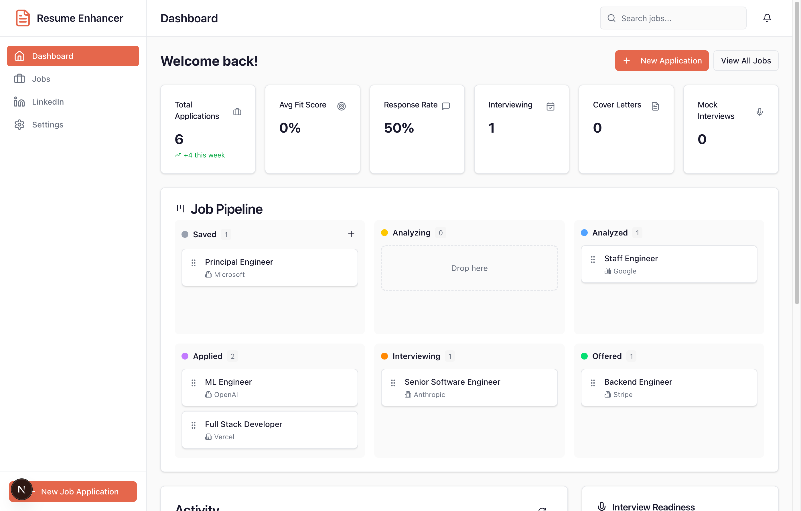
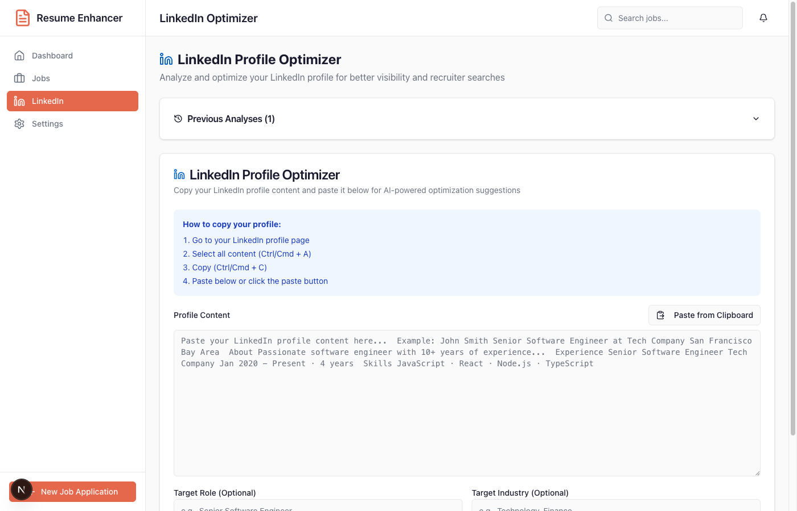
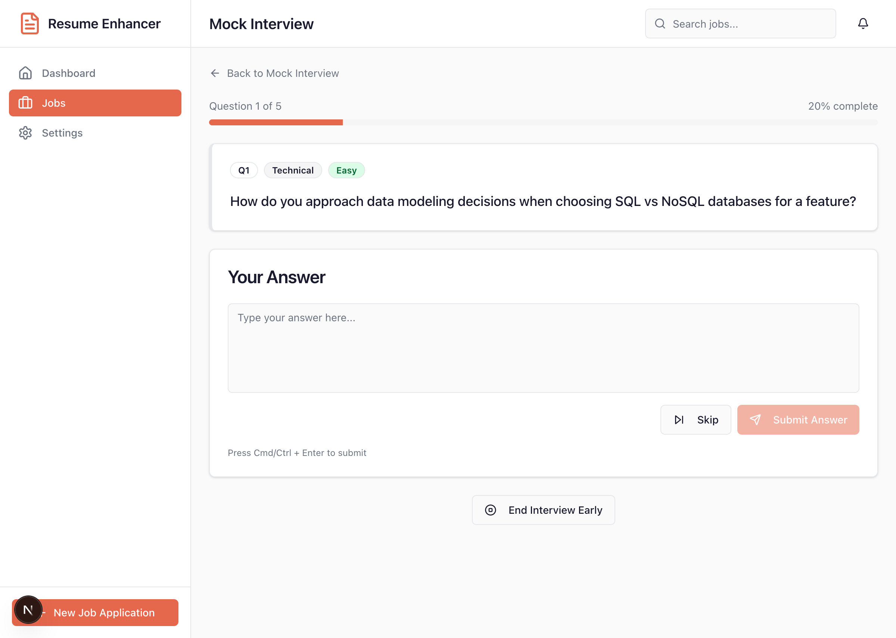

# JobReady

**Stop hoping you'll get the job. Know you will.**

[](https://github.com/robfosterdotnet/JobReady/actions/workflows/ci.yml)


---

## The Problem

You're qualified. You know it. But somehow, you're still:

- Sending resumes into the void and hearing nothing back
- Walking into interviews without knowing what they'll ask
- Googling the company 10 minutes before your call
- Writing the same generic cover letter for the 50th time
- Wondering why candidates with worse experience keep getting offers

**The difference between you and them isn't skill. It's preparation.**

---

## The Solution

JobReady is your AI-powered command center for job hunting. It doesn't just help you apply—it makes sure you're the most prepared candidate in the room.

### See It In Action








---

## What You Get

### Resume Analysis That Actually Helps
Upload your resume. Paste the job description. Get a fit score, keyword gaps, and **exact rewrites** to make your resume match what they're looking for. No more guessing.

### Company Intel That Impresses
Know the CEO's name. Know their recent funding. Know about that lawsuit they're dealing with. Walk into every interview knowing more about the company than most employees do.

### LinkedIn That Gets Found
Your profile is costing you interviews. JobReady analyzes it against your target role and gives you three better headlines, a rewritten summary, and the exact keywords recruiters are searching for.

### Interview Prep That Works
Practice with AI that adapts to your answers. Get scored on STAR method. Know your weak spots before the real interview exposes them.

### Cover Letters in 30 Seconds
Stop staring at blank pages. Generate tailored cover letters that reference the company's actual values and your actual experience.

### Track Everything
Visual Kanban pipeline. Never lose track of where you are with each application. See your progress. Stay motivated.

---

## The Numbers

| What You Get | Traditional Approach | With JobReady |
|--------------|---------------------|---------------|
| Resume tailoring | 45 min per application | 2 minutes |
| Company research | 2+ hours of Googling | 30 seconds |
| Interview prep | Hope for the best | Know every likely question |
| Cover letters | Painful | Painless |
| LinkedIn optimization | Hire an expensive coach | Built in |

---

## Quick Start

```bash
git clone https://github.com/robfosterdotnet/JobReady.git
cd JobReady
npm install
cp .env.example .env   # Add your Azure OpenAI credentials
npm run db:push
npm run dev
```

Open [http://localhost:3000](http://localhost:3000) and start preparing like a professional.

---

## Tech Stack

| Layer | Technology |
|-------|------------|
| Framework | Next.js 16+ (App Router) + TypeScript |
| AI | Azure OpenAI (gpt-5.2) |
| Database | SQLite + Drizzle ORM (20 tables) |
| Web Search | Brave Search API + DuckDuckGo fallback |
| UI | Tailwind CSS v4 + shadcn/ui |
| Testing | Vitest + React Testing Library (146 tests) |

**Codebase:** 256 TypeScript files • 88 React components • 34 API routes • 7 AI agents

---

## Environment Variables

```bash
# Required - Azure OpenAI
AZURE_OPENAI_ENDPOINT=https://your-resource.openai.azure.com/
AZURE_OPENAI_API_KEY=your-api-key
AZURE_OPENAI_DEPLOYMENT=gpt-5.2
AZURE_OPENAI_API_VERSION=2024-07-01-preview

# Required - Database
DATABASE_URL=file:./data/jobready.db

# Required for production
AUTH_SECRET_TOKEN=your-secure-random-token-min-32-chars

# Optional - Better search results
BRAVE_SEARCH_API_KEY=your-brave-api-key
```

---

## Features Deep Dive

### Resume Analyzer
- **Fit Score**: 0-100% match rating with detailed breakdown
- **Keyword Analysis**: See exactly which terms you're missing
- **Enhancement Suggestions**: Before/after text you can copy directly
- **Interview Questions**: 15-20 likely questions with suggested answers

### Company Research
- Leadership team with LinkedIn profiles
- Financial info (revenue, funding, stock price)
- Recent news with sentiment analysis
- Legal issues and regulatory concerns
- Ethics alignment scoring
- Glassdoor-style culture insights

### LinkedIn Optimizer
- Profile score with section-by-section breakdown
- Three alternative headlines (tested formulas)
- Rewritten summary optimized for recruiters
- Skills gap analysis
- SEO keyword suggestions
- Completeness checklist

### Mock Interviewer
- Configurable sessions (5-20 questions)
- Difficulty levels from entry to executive
- STAR method analysis for behavioral questions
- Real-time feedback or summary mode
- Voice input/output support
- Performance tracking across sessions

### Cover Letter Generator
- Tone options: formal, conversational, enthusiastic
- Length options: short, medium, long
- Integrates your resume analysis insights
- Save multiple versions
- Inline editing with revert

### Interviewer Research
- Parse interviewer LinkedIn profiles
- Predict questions they'll ask (with reasoning)
- Find common ground and talking points
- Preparation tips specific to each person

---

## Deployment

**Supported:** Vercel, Docker, VPS (DigitalOcean, Linode, AWS EC2)

**Requires:** Node.js runtime, filesystem access for SQLite

### Vercel (Quickest)
1. Import repo at [vercel.com/new](https://vercel.com/new)
2. Add environment variables
3. Deploy

### Docker
```bash
docker-compose up -d --build
```

### VPS
```bash
npm ci && npm run build
pm2 start ecosystem.config.js
```

---

## Development

```bash
npm run dev          # Start development server
npm run build        # Production build
npm run test         # Run all tests
npm run lint         # Run ESLint
npm run db:push      # Push schema changes
npm run db:studio    # Inspect database
```

---

## Documentation

| File | Description |
|------|-------------|
| `SPECIFICATION.md` | Technical specification |
| `CLAUDE.md` | AI assistant guidance |
| `AGENTS.md` | AI agent documentation |

---

## Version History

| Version | Date | Highlights |
|---------|------|------------|
| v1.0 | Jan 3, 2026 | Resume analysis, company research, chat |
| v1.1 | Jan 3, 2026 | Mock interview practice with AI feedback |
| v1.2 | Jan 4, 2026 | Security hardening, 14 issues resolved |
| v1.3 | Jan 5, 2026 | LinkedIn optimization, cover letters, interviewer research, dashboard |

---

## Your Next Job Is Waiting

The best candidates don't wing it. They prepare. JobReady gives you the same preparation that career coaches charge thousands for.

**Clone it. Run it. Land the job.**

---

## License

MIT
